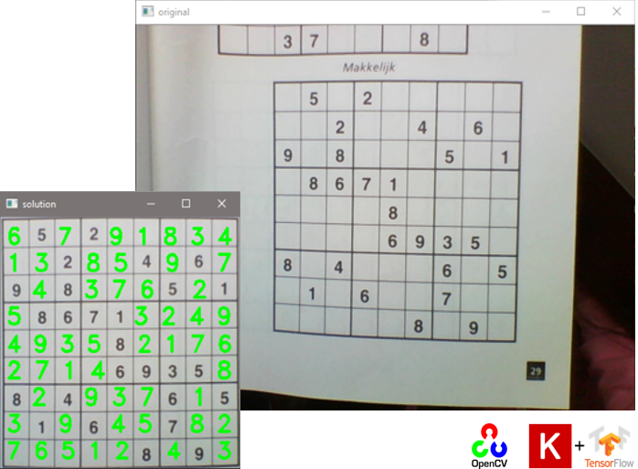
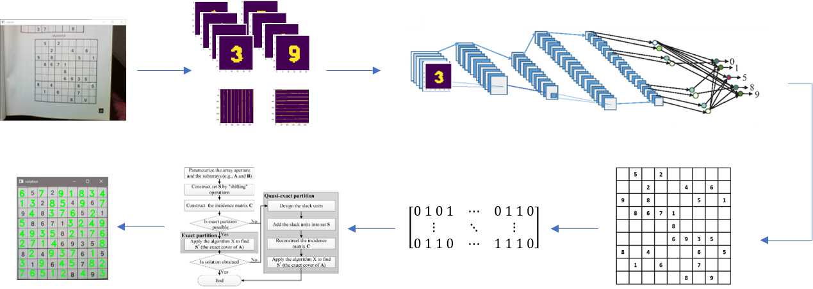

-----------
This is a real-time sudoku solver built in **Python** using [*OpenCV*](https://opencv.org/), [*Keras*](https://keras.io/), and Knuth's [*Algorithm X*](https://en.wikipedia.org/wiki/Knuth%27s_Algorithm_X). 

## Inputs
Live webcam stream
## Usage
`python3 main.py`
## Basic Overview

The main function uses four different classes: *Grab*, *Digit_Recognizer*, *Solve* and *Plot*

#### Grab
The *Grab* class, processes the video stream and outputs a list of images (numpy arrays) containing images of all the cells in the grid (numpy arrays), along with the grid dimensions. The output object is used in the *Digit_Recognizer* class

#### Digit_Recognizer
This class consists primarily of a pre-trained Convolutional Neural Network (CNN) that has been trained on a custom dataset: The combination of [MNIST](http://yann.lecun.com/exdb/mnist/) with a smaller dataset of images containing the digits 0-9, written in all the fonts whipped with Microsoft Windows. The model architecture, the code to train it, train/test results, and the script to generate the printed digits can be found in the digit recognition folder. Final accuracy on the test set was 97.89%.

#### Solve
The solver class reformulates the sudoku as an exact cover problem, which then solves using Knuth's algorithm X.

#### Plot
Finally, the solution is displayed back to the user, using the Plot class.

